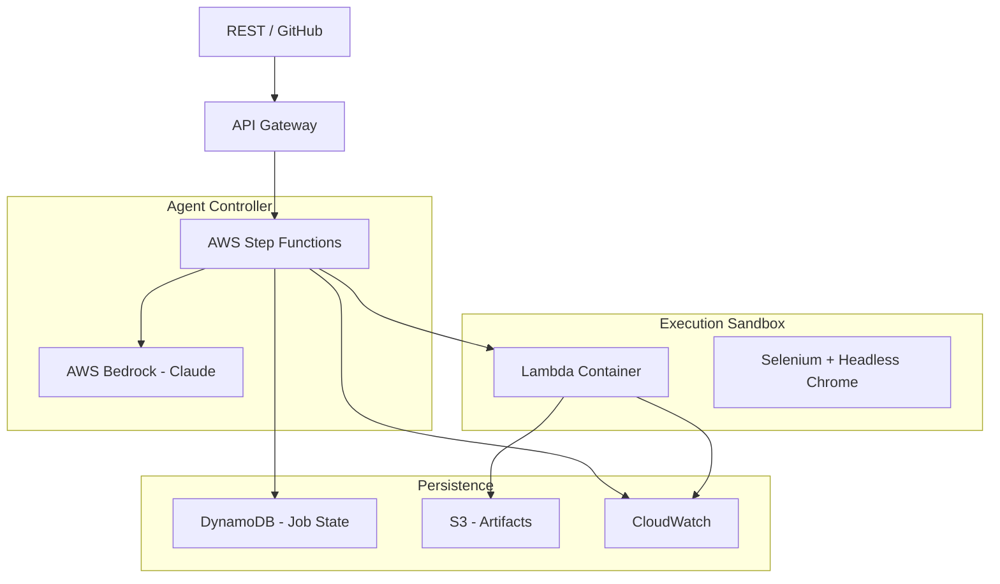
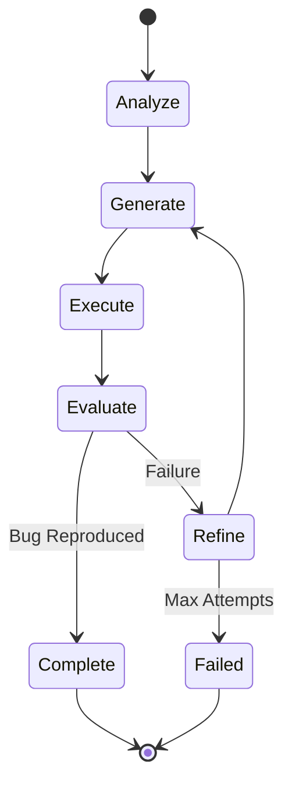

# AutoRepro – System Design Document

## 1. Overview

AutoRepro is an **agentic, serverless AI system** that autonomously converts vague bug reports into **verified Python/Selenium reproduction scripts**.

Unlike traditional LLM-based code generators, AutoRepro **does not stop at code generation**. It executes the generated script in a secure sandbox, evaluates the outcome, and **iteratively refines the script using structured failure feedback**, until the bug is reproduced or bounded attempts are exhausted.

The system is built using **pure prompt engineering and agentic orchestration**, with AWS Step Functions acting as the agent controller, AWS Bedrock as the reasoning engine, and AWS Lambda container images as the execution sandbox.

---

## 2. Core Design Principles

1. **Agentic First**  
   The system is modeled as an autonomous agent with perception, reasoning, action, and reflection loops.

2. **Prompt-Driven Logic**  
   All intelligence (analysis, refinement, decision-making) lives in prompts, not hard-coded rules.

3. **Serverless Realism**  
   Stateless compute, persisted state, bounded retries, and explicit time limits.

4. **Execution as Ground Truth**  
   A script is considered valid only if it actually reproduces the bug.

5. **Security by Design**  
   Generated code is treated as untrusted and executed under strict constraints.

---

## 3. High-Level Architecture



---

## 4. Why Step Functions (Agentic Controller)

AWS Step Functions is used as the explicit AI agent loop, not just orchestration.

**Why this matters to evaluation:**
- Makes the agent's reasoning steps visible and auditable
- Built-in retries, branching, and timeouts
- Prevents Lambda timeout misuse
- Clearly demonstrates autonomous decision-making

**Each Step represents one cognitive action:**
- Analyze
- Generate
- Execute
- Evaluate
- Refine or Stop

---

## 5. Agent Workflow (Autonomous Loop)



---

## 6. Component Breakdown

### 6.1 API Gateway

**Purpose**
- Entry point for bug report submissions
- Integrates with REST clients and GitHub issues

**Endpoints**
- `POST /reproduce`
- `GET /status/{job_id}`
- `GET /result/{job_id}`
- `POST /webhook/github`

### 6.2 Step Functions – Agent Controller

**Responsibilities**
- Maintain agent state
- Call AWS Bedrock with correct prompts
- Invoke execution sandbox
- Decide retry vs terminate
- Enforce attempt and time bounds

**Design Decision:** All reasoning is handled via prompts and state transitions. Lambda functions remain logic-light and execution-focused.

### 6.3 AWS Bedrock (Reasoning Engine)

**Model Strategy**
- Claude 3 Haiku – default (fast, cost-efficient)
- Claude Sonnet – fallback after repeated failures

**Agent Capabilities**
- Bug report analysis
- Script generation
- Failure interpretation
- Script refinement

**Prompt: Bug Analysis**
```
You are an expert QA automation engineer.

Analyze the following bug report and infer:
1. Observable symptoms
2. Expected vs actual behavior
3. Inferred reproduction steps
4. Target UI elements
5. Validation criteria for success

Bug Report:
{bug_report}

Target URL:
{target_url}
```

**Prompt: Script Generation**
```
Generate a Python Selenium script to reproduce the bug.

Constraints:
- Headless Chrome
- Explicit waits (no sleep)
- Clear logging
- Screenshot on failure
- Print "REPRODUCED" if bug occurs

Analysis:
{analysis}

Previous Attempts Summary:
{previous_attempts}
```

**Prompt: Refinement (Agent Reflection)**
```
The previous script failed.

Failure Details:
{failure_feedback}

Update the script to address the failure.
Do not repeat the same mistake.
```

---

## 7. Execution Sandbox (Lambda Container)

### Why Lambda Is Used

There is no AWS-native alternative that is:
- Serverless
- Capable of running Selenium
- Scalable for concurrent jobs
- Hackathon-feasible

### Execution Environment

- **Runtime:** Python 3.9
- **Headless Chrome + ChromeDriver**
- **Memory:** ~3008 MB
- **Filesystem:** Read-only except `/tmp`
- **Timeout:** Per-attempt bounded to enforce global limits

### Security Guardrails

**Pre-execution**
- AST scanning to block unsafe imports (`os`, `subprocess`, `socket`, `shutil`)
- Regex detection of system calls
- Input sanitization

**During execution**
- Hard execution timeout
- No AWS credentials available inside container
- Network access limited to public internet only

---

## 8. Persistent State Management (DynamoDB)

### Job State Model

```json
{
  "job_id": "uuid",
  "status": "ANALYZING | EXECUTING | COMPLETED | FAILED",
  "bug_report": "string",
  "attempt_count": 2,
  "max_attempts": 3,
  "current_prompt_context": "...",
  "last_error": "...",
  "final_result": {
    "success": true,
    "script_s3_path": "...",
    "logs_s3_path": "...",
    "screenshots": ["..."]
  }
}
```

**Benefits**
- Survives cold starts
- Enables async APIs
- Makes the agent truly stateful

---

## 9. Failure Feedback Contract (Core Innovation)

```json
{
  "attempt_number": 2,
  "error_type": "ElementNotFound",
  "error_message": "Login button not found",
  "last_action": "driver.find_element(...)",
  "stack_trace": "...",
  "screenshot": "s3://autorepro/jobs/.../error.png"
}
```

This structured feedback is injected directly into refinement prompts, enabling autonomous self-correction.

---

## 10. Artifacts & Storage

### S3 Layout

```
autorepro-artifacts/
 └── jobs/{job_id}/
     ├── script.py
     ├── execution.log
     ├── screenshots/
     └── metadata.json
```

---

## 11. Observability & Monitoring

- **Correlation ID:** `job_id`
- **CloudWatch logs for:**
  - Agent decisions
  - Prompt versions
  - Execution outcomes
- **Metrics:**
  - Success rate
  - Average attempts
  - Execution latency

---

## 12. Correctness Guarantees (Design-Time)

### Bounded Autonomy
The agent never exceeds max attempts or execution limits.

### Execution-Grounded Validation
Scripts are accepted only if runtime evidence confirms reproduction.

### Isolation
Each job executes independently in a sandboxed environment.

### Deterministic APIs
API responses reflect persisted job state only.

---

## 13. Testing Strategy (MVP-Oriented)

End-to-end agent scenarios:
- Successful reproduction
- Failure → refinement
- Timeout → retry
- Max attempts reached

Focus on agent behavior visibility. No heavy property-based testing in MVP.

---

## 14. Mapping to Evaluation Criteria

| Evaluation Aspect | AutoRepro Alignment |
|------------------|---------------------|
| Innovation | Autonomous agent loop with execution feedback |
| Technical Depth | Step Functions + Bedrock + secure Lambda |
| Feasibility | Bounded retries, cost-aware model usage |
| Usability | REST + GitHub workflow integration |
| Impact | Reduces manual bug reproduction effort |

---

## 15. Summary

**AutoRepro is not a code generator. It is an autonomous debugging agent.**

By combining:
- Prompt engineering
- Agentic orchestration
- Real execution feedback
- Secure serverless infrastructure

AutoRepro delivers a practical, explainable, and high-impact system aligned with real-world developer workflows and hackathon evaluation criteria.